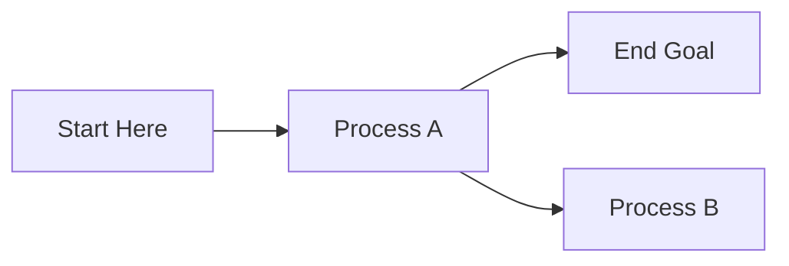
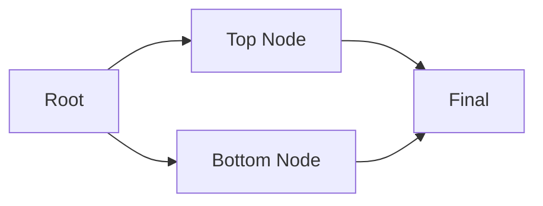
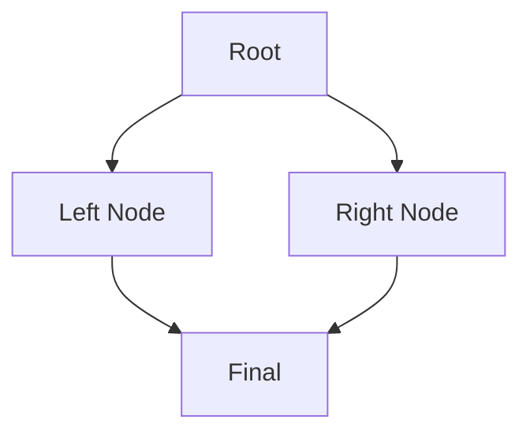

# mermaidtui

Deterministic, readable Unicode/ASCII rendering of Mermaid diagrams in your terminal.
By Tariq Shams.


Sometimes you need to visualize a diagram in a terminal environment: TUI apps, CI logs or just quick terminal previews, where SVG or heavy headless browsers aren't an option. `mermaidtui` provides a lightweight engine to render simple Mermaid flowcharts as clean Unicode or ASCII boxes.
Written in TypeScript.

## Features

- **Standard Mermaid Syntax**: Supports a subset of the Mermaid flowchart syntax.
- **Unicode & ASCII**: Beautiful Unicode boxes by default, with an ASCII fallback mode.
- **Deterministic Layout**: Grid-based layout engine that prioritizes readability.
- **Zero Heavy Dependencies**: No Mermaid internals, no Chromium/Puppeteer, no SVG conversion.

## Supported Syntax (v0.0.5)
Currently v0.0.5 supports a robust subset of flowcharts:



- **Directions**: `LR`, `RL`, `TB`, `BT`.
- **Nodes**: Alphanumeric IDs and square labels `A[Label with spaces]`.
- **Edges**: Directed arrows `-->`, including **Chained Edges** (`A --> B --> C`).
- **Visuals**: Intelligent corner rendering (`┌`, `┐`, `└`, `┘`) for orthogonal paths.

## Showcase

### Complex LR Layout
**Input:**

**Output:**
```
              ┌────────┐                    
          ┌──▶│Top Node│─────┐              
          │   └────────┘     │              
┌────┐    │                  │     ┌─────┐  
│Root│────┐                  └─┌──▶│Final│  
└────┘    │                    │   └─────┘  
          │                    │            
          │   ┌───────────┐    │            
          └──▶│Bottom Node│────┘            
              └───────────┘                 
```

### Complex TB Layout
**Input:**

**Output:**
```
            ┌────┐               
            │Root│               
            └────┘               
               │                 
               │                 
     ┌─────────└─────────┐       
     ▼                   ▼       
┌─────────┐        ┌──────────┐  
│Left Node│        │Right Node│  
└─────────┘        └──────────┘  
     │                   │       
     │                   │       
     └─────────┌─────────┘       
               ▼                 
            ┌─────┐              
            │Final│              
            └─────┘              
```

## Installation

```bash
npm install mermaidtui
```

## Usage

### CLI

```bash
# Render a file
mermaidtui diagram.mmd

# Pipe input
cat diagram.mmd | mermaidtui --ascii
```

### Library

```typescript
import { renderMermaidToTui } from 'mermaidtui';

const input = `flowchart LR
    A[Start] --> B[End]`;

const output = renderMermaidToTui(input, { ascii: false });
console.log(output);
```

## Collaborators & Local Development

We welcome contributions! To test changes locally across repositories:

1.  **Clone & Link**:
    ```bash
    git clone https://github.com/tariqshams/mermaidtui.git
    cd mermaidtui
    npm install
    npm run build
    npm link
    ```

2.  **Use in another project**:
    ```bash
    cd ../your-other-project
    npm link mermaidtui
    ```

3.  **Run Tests**:
    ```bash
    # Run unit tests
    npm test

    # View visual output for all test cases
    npm run dump-visual-test
    ```

## License

Apache 2.0
