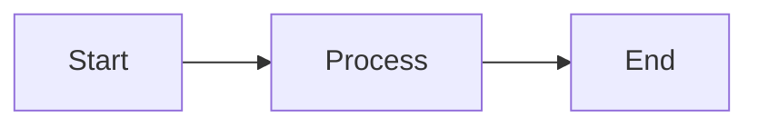
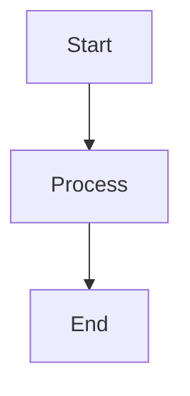

# mermaidtui

Deterministic, readable Unicode/ASCII rendering of Mermaid diagrams in your terminal.
By Tariq Shams.


Sometimes you need to visualize a diagram in a terminal environment: TUI apps, CI logs or just quick terminal previews, where SVG or heavy headless browsers aren't an option. `mermaidtui` provides a lightweight engine to render simple Mermaid flowcharts as clean Unicode or ASCII boxes.
Written in TypeScript.

## Features

- **Standard Mermaid Syntax**: Supports a subset of the Mermaid flowchart syntax.
- **Unicode & ASCII**: Beautiful Unicode boxes by default, with an ASCII fallback mode.
- **Deterministic Layout**: Grid-based layout engine that prioritizes readability.
- **Zero Heavy Dependencies**: No Mermaid internals, no Chromium/Puppeteer, no SVG conversion.

## Supported Syntax (v0.0.3)
Currently v0.0.3 supports a strict subset of flowcharts:



- **Directions**: `LR`, `RL`, `TB`, `BT`.
- **Nodes**: Alphanumeric IDs and square labels `A[Label]`.
- **Edges**: Directed arrows `-->` only.

### Unsupported in v0.0.3

- Subgraphs
- Edge labels
- Multiple arrow types (`<-->`, `-.->`)
- Diagonal routing
- Gantt, Sequence, etc.

## Installation

```bash
npm install mermaidtui
```

## Usage

### CLI

```bash
# Render a file
mermaidtui diagram.mmd

# Pipe input
cat diagram.mmd | mermaidtui --ascii
```

### Library

```typescript
import { renderMermaidToTui } from 'mermaidtui';

const input = `flowchart LR
    A[Start] --> B[End]`;

const output = renderMermaidToTui(input, { ascii: false });
console.log(output);
```

## Example Output

**Input:**


**Output:**
```
 ┌─────┐   
 │Start│   
 └─────┘   
    │      
    ▼      
┌───────┐  
│Process│  
└───────┘  
    │      
    ▼      
  ┌───┐    
  │End│    
  └───┘
```

## License

Apache 2.0
